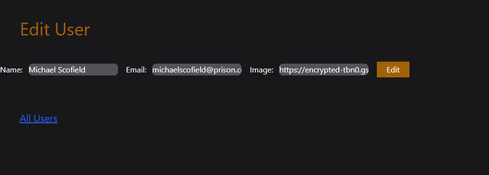

# UserHub

UserHub is a simple CRUD application that allows users to create, read, update, and delete their profiles. It is built using Express.js and MongoDB, and the project follows the MVC (Model-View-Controller) architecture with EJS as the templating engine.

## Features

- Create user profiles with a name, email, and image URL
- View all users in a list of cards
- Edit existing user details
- Delete users from the list

## Tech Stack

- **Backend**: Node.js, Express.js
- **Database**: MongoDB
- **Frontend**: HTML, EJS, Tailwind CSS
## ScreenShots




## Installation

1. Clone the repository:
    ```bash
    git clone https://github.com/VishalOjhaa/UserHub.git
    ```

2. Navigate to the project directory:
    ```bash
    cd UserHub
    ```

3. Install the required dependencies:
    ```bash
    npm install
    ```

4. Start the server:
    ```bash
    node index
    ```

The application will run on `http://localhost:3000`.

## Usage

- Access the home page to create a new user.
- View all users on the `/read` page.
- Edit and delete users from the list.
  
## Contributing

Feel free to fork this project and submit pull requests with improvements or bug fixes.

## License

This project is open-source and available under the [MIT License](LICENSE).
